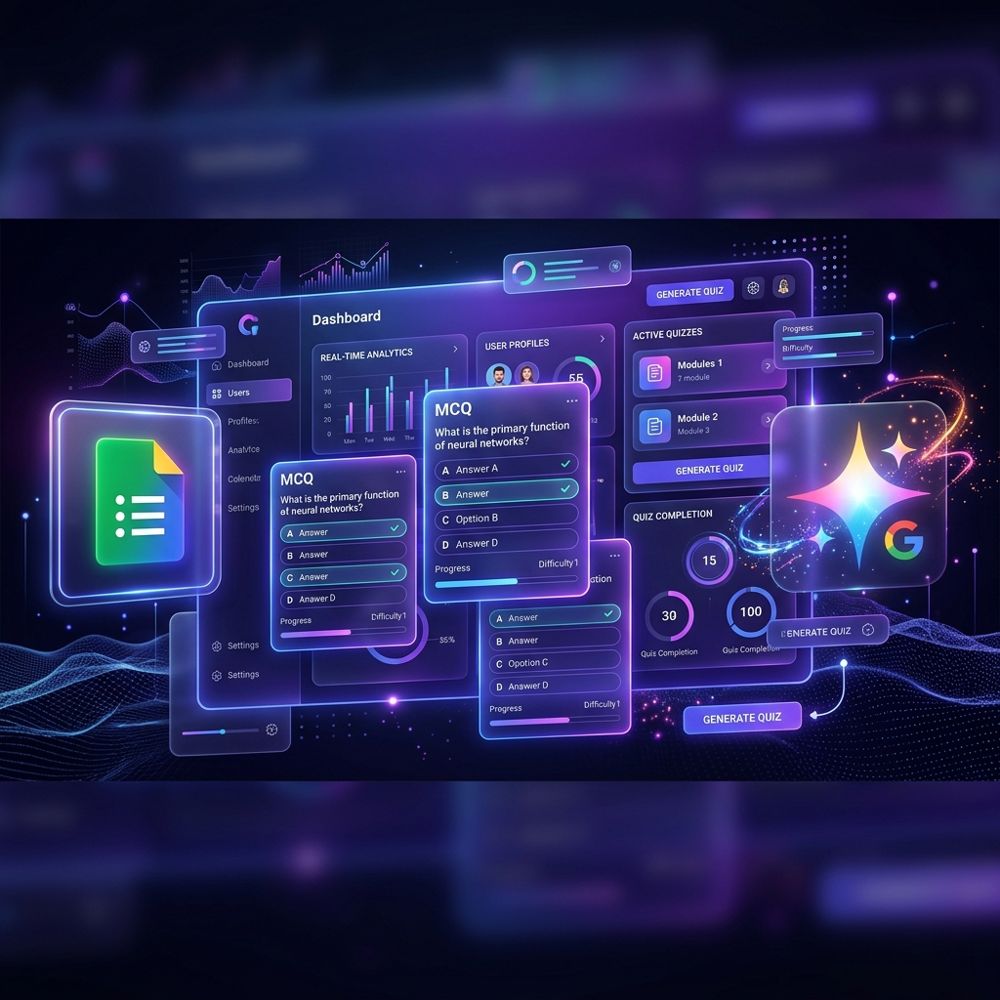

<div align="center">
  

  # 🧠 AI Quiz Automator (Minimalist Edition)
  
  **A high-precision, professional assessment platform that generates, deploys, and analyzes quizzes using ultra-fast Llama-powered intelligence.**
  
  [](https://reactjs.org/)
  [](https://vitejs.dev/)
  [](https://tailwindcss.com/)
  [](https://groq.com/)
</div>

<br />

Welcome to the **AI Quiz Automator**, a professional-grade tool designed for educators and trainers. By focusing on a minimalist aesthetic and lightning-fast AI (Llama 3.3 via Groq), it transforms complex syllabuses into structured Google Forms assessments in seconds.

---

## 🔥 Core Capabilities

### ⚡ Intelligence by Groq
- **Llama 3.3 70B Inference**: Experience near-instant question generation even for advanced topics.
- **Context-Aware MCQs**: The AI analyzes your syllabus input to craft deep, analytical, and fair questions.

### 💼 Google Workspace Integration
- **Zero-Touch Deployment**: Instantly turn generated questions into a fully functional Google Form Quiz. Inclusive of student detail fields (Name, Roll, Branch).
- **Live Response Sync**: Track student scores in real-time as they submit, directly through the Google Forms API.

### 📊 Professional Analytics
- **Data Visualization**: Built-in bar charts provide an immediate overview of class performance.
- **Smart Result Fetching**: Manual sync ensures zero background API wastage while keeping your data fresh.

### 📂 The Vault (History)
- A persistent local history of all your past quizzes. Re-view, re-access links, and refresh analytics for any test at any time.

---

## 🎨 Minimalist Design Philosophy
- **Professional Typography**: Powered by **Inter** for maximum legibility and a modern look.
- **snappy & Focused**: No heavy animations or distracting backgrounds—just a clean, efficient workspace.
- **Adaptive Dark Mode**: A meticulously tuned theme that is easy on the eyes during long sessions.

---

## 🛠️ Technology Stack

| Layer | Stack |
|-------|-------|
| **Frontend** | React 19, Vite |
| **Styling** | Tailwind CSS (Minimal Concept) |
| **Icons & Charts** | Lucide-React, Recharts |
| **Intelligence** | Groq Cloud (Llama 3.3 70B) |
| **Infrastructure** | Google Forms API, OAuth 2.0 |

---

## 🚀 Deployment & Setup

### 1. Environment Configuration
Create a `.env` file in the root directory:
```env
# AI Intelligence (Groq Console)
VITE_GROQ_API_KEY=your_groq_key_here

# Google Identity (Google Cloud Console)
VITE_GOOGLE_CLIENT_ID=your_client_id_here
```

### 2. Installation
```bash
npm install
npm run dev
```

### 3. Vercel Deployment Note
Ensure that the above Environment Variables are added in the Vercel Dashboard under **Project Settings > Environment Variables**. Additionally, whitelist your Vercel URL in the **Google Cloud Console** under "Authorized JavaScript Origins".

---

## 📜 License
Distributed under the MIT License. See `LICENSE` for more information.

<div align="center">
  <p>Crafted for efficiency. Optimized for clarity.</p>
</div>
